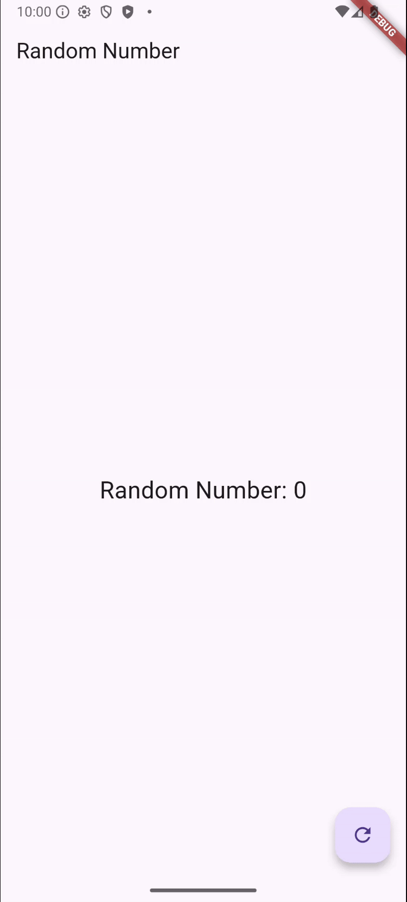

Hanif Faishal Hilmi
TI-3F
Absen 15

# Jobsheet 12: Streams

## Praktikum  7: BLoC Pattern

### Soal 13

- Jelaskan maksud praktikum ini ! Dimanakah letak konsep pola BLoC-nya ?
Praktikum ini bermaksud untuk menjelaskan konsep Stream, Sink, dan BLoC pattern pad flutter melalui contoh sederhana. Konsep BLoC dapat diperhatikan dari membuat angka random, meneruskan angka ke stream, mengontrol input melalui sink, mengelola logika bisnis di class terpisah, dan menampilkan hasilnya ke UI dengan StreamBuilder.

- Capture hasil praktikum Anda berupa GIF dan lampirkan di README.
