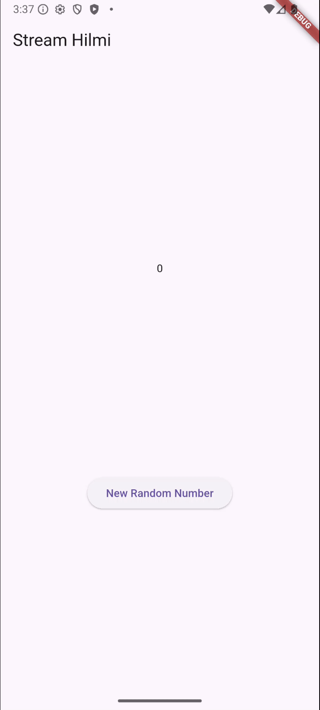

Hanif Faishal Hilmi
TI-3F
Absen 15

# Jobsheet 12: Streams

## Praktikum 2: Stream controllers dan sinks

### Soal 6

- Jelaskan maksud kode langkah 8 dan 10 tersebut!

    - langkah 8 adalah kode untuk menghubungkan NumberStream ke UI. Ketika ada perubahan data dari stream, UI akan langsung update.

    - langkah 10 adalah fungsi untuk mengirim angka random ke stream setiap button ditekan.

- Capture hasil praktikum Anda berupa GIF dan lampirkan di README.

