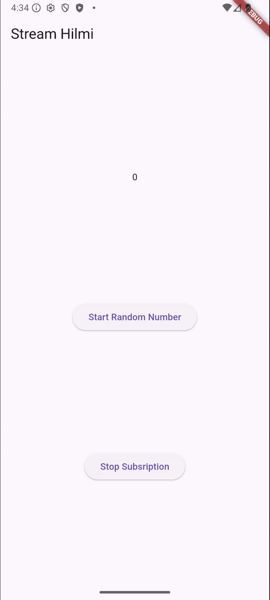

Hanif Faishal Hilmi
TI-3F
Absen 15

# Jobsheet 12: Streams

## Praktikum 4: Subscribe ke stream events

### Soal 9

- Jelaskan maksud kode langkah 2, 6 dan 8 tersebut!
    - langkah 2: pembuatan StreamSubscription untuk listener. jadi, setiap ada angka baru yang masuk ke stream, fungsi ini dipanggil. Lalu, UI diupdate dengan angka terbaru.
    - langkah 6: subscription.cancel() dibuat untuk menghapus listener, sehingga tidak ada memory leak dan event masuk setelah widget hilang.
    - langkah 8: fungsi untuk membuat angka random. Lalu, jika stream dibuka, angka tetap bisa diubah. Jika stream ditutup, akan muncul pesan error berupa nilai -1.

- Capture hasil praktikum Anda berupa GIF dan lampirkan di README.
