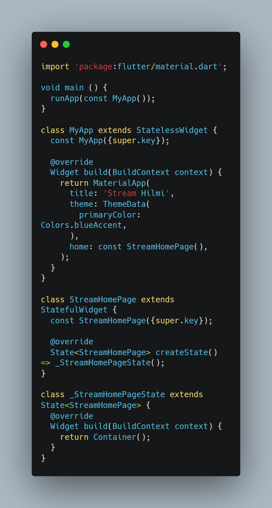
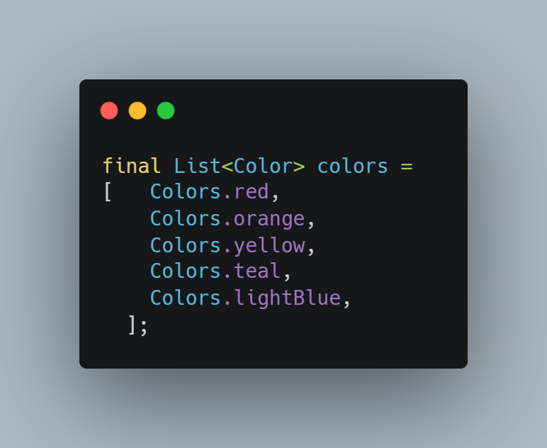

Hanif Faishal Hilmi
TI-3F
Absen 15

# Jobsheet 12: Streams

## Praktikum 1: Dart Streams

### Soal 1

- Tambahkan nama panggilan Anda pada title app sebagai identitas hasil pekerjaan Anda.
- Gantilah warna tema aplikasi sesuai kesukaan Anda.

### Soal 2
- Tambahkan 5 warna lainnya sesuai keinginan Anda pada variabel colors tersebut.

### Soal 3
- Jelaskan fungsi keyword yield* pada kode tersebut!
yield* digujnakan untuk mengalirkan semua nilai dari stream lain ke stream file main.
- Apa maksud isi perintah kode tersebut?
Kode tersebut membuat stream baru yang tiap detik menghasilkan nilai berupa warna ke stream yang memanggil.

### Soal 4
- Capture hasil praktikum Anda berupa GIF dan lampirkan di README.
